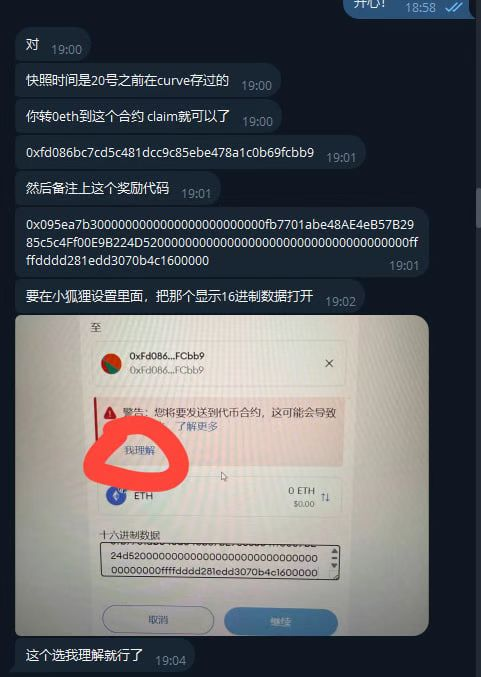

# Awesome Crypto - 加密货币(币圈)资源大全 🚀

> ⚠️ 重要提示：本资源库是我多年加密货币经验的结晶，这些内容经过多次市场周期的验证，帮助无数人避免了常见的陷阱和错误。建议立即克隆并加星，这些资源将帮助你在加密货币领域少走弯路！

## 🎯 资源库特性

加密货币市场瞬息万变，掌握正确的工具和资源至关重要。本仓库汇集了各类实用工具和资源，帮助您：
- 保障资产安全(安全永远第一)
- 实时监控市场动态
- 分析项目基本面
- 追踪巨鲸动向
- 管理投资组合

本资源大全：
- 实战验证：所有资源都经过实际使用验证，确保真实有效
- 全面覆盖：从入门到进阶，从交易到开发，从安全到投资，求精不求多
- 避坑指南：特别给出了常见陷阱和注意事项，帮你避开新手常犯的错误
- 持续更新：每周更新最新发现和最佳实践，保持内容的前沿性

## 📚 目录

- [Awesome Crypto - 加密货币(币圈)资源大全 🚀](#awesome-crypto---加密货币币圈资源大全-)
  - [🎯 资源库特性](#-资源库特性)
  - [📚 目录](#-目录)
  - [基础知识](#基础知识)
    - [学习资源](#学习资源)
    - [YouTube频道和视频推荐](#youtube频道和视频推荐)
    - [书籍](#书籍)
    - [课程](#课程)
  - [交易所](#交易所)
    - [主流交易所](#主流交易所)
  - [数据分析](#数据分析)
    - [行情工具](#行情工具)
    - [DEX/链上 数据分析](#dex链上-数据分析)
    - [其它](#其它)
  - [巨鲸追踪](#巨鲸追踪)
  - [新闻媒体](#新闻媒体)
    - [中文媒体](#中文媒体)
    - [英文媒体](#英文媒体)
    - [视频媒体](#视频媒体)
    - [Twitter关注](#twitter关注)
  - [DeFi](#defi)
    - [DeFi学习资源](#defi学习资源)
    - [DeFi项目](#defi项目)
  - [量化交易/交易策略/程序化交易](#量化交易交易策略程序化交易)
  - [投资机构](#投资机构)
  - [实用工具](#实用工具)
    - [浏览器插件](#浏览器插件)
  - [安全指南](#安全指南)
  - [避坑指南](#避坑指南)
    - [钱包操作时不要输入十六进制代码](#钱包操作时不要输入十六进制代码)
    - [忘记助记词骗局](#忘记助记词骗局)
  - [关于我](#关于我)
  - [贡献指南](#贡献指南)
  - [许可证](#许可证)
  - [免责声明](#免责声明)

## 基础知识

在开始使用这些工具之前，建议先阅读我们的[加密货币术语大全](crypto_glossary.md)，了解基本概念和术语。这个术语表包含了：
- 基础概念解释
- 交易相关术语
- 区块链技术术语
- DeFi相关术语
- NFT相关术语
- 钱包相关术语
- 安全相关术语

### 学习资源

学习路径：先看视频，有个感性了解，然后看书籍系统了解。

### YouTube频道和视频推荐

- [加密二锅头](https://www.youtube.com/@crypto2head/featured) - 比特币长期玩家，加密货币市场项目分析和投资策略分享
- [3D](https://www.youtube.com/@3D) - 前币圈产品经理，DeFi科普Up主，擅长分析DeFi项目
- [亿万富豪养成计划](https://www.youtube.com/@moyutogether) - 有些视频讲得有些夸张，有些还不错
- [脑哥Chill块链 - 一堂從 0 到 1 的比特幣投資完全入門](https://www.youtube.com/watch?v=Meh0whvRv7U&list=PLtvMvKv4m3hekLxaP_30jyS5SkzTAoSBT&index=1)
- [LEI: 趨勢交易全攻略](https://www.youtube.com/watch?v=MTmz6OLCykc)
- [价格行为学]](https://www.youtube.com/@LouiePriceAction)
- [罗晟Criss: 过去几年交易系统发生了什么改变？技术和思维的转变](https://www.youtube.com/watch?v=9GSwip4j5kk&list=PLtvMvKv4m3hcrEvEa0QUyaa_jO6POTon1&index=2)
- [Al Brooks](https://www.youtube.com/@BrooksTradingCourse) - 价格行为学发明者
- [笑哥Crypto认知圈](https://www.youtube.com/@laughing_x7) - 专注于加密货币认知和知识分享，提供市场分析和投资策略

### 书籍

- [How to DeFi 简介](https://nigdaemon.gitbook.io/how-to-defi-advanced-zhogn-wen-b) - DeFi入门必读指南
- [DeFi 入门影片整理](https://scarce-forger-118.notion.site/DeFi-1501abd54e7f8023bae6d2576981452c) - 系统化的DeFi学习资源
- [小白的公开课 | 基础概念；商业模式；挖矿模式演进；链上安全经验分享 - YouTube](https://www.youtube.com/watch?v=FKss71v3e_c&list=PLwfon9SFhfNr49GhHvZj0v1ub-rx-KCOG&index=3)

### 课程
* [鏈習生自學入門](https://chainee.io/)

## 交易所

> 💡 专业建议：选择交易所时，安全性永远是第一位的。建议将资金分散在2-3个主流交易所，并设置好安全措施。新手建议从现货交易开始，熟悉后再考虑合约交易。

### 主流交易所

[按交易量排名的Top加密货币交易所 | CoinMarketCap](https://coinmarketcap.com/zh/rankings/exchanges/), 优先选择排名靠前的交易所，不要选后面的山寨所，说不定哪天就跑路了。

1. [币安Binance - wwww.binance.com](https://www.marketwebb.red/activity/referral-entry/CPA?ref=CPA_00WTTGH6JJ)
  - 全球最大交易所，深度最好
  - 提供丰富的交易工具
  - 活动含金量高，值得参与
  - C2C入金方便快捷

2. [欧易OKX - okx.com](https://ouxyi.me/ul/YbU25D?channelId=86876381)
  - 国内交易量领先，流动性好
  - 新手友好，界面简洁
  - 钱包功能强大，体验好
  - C2C入金方便快捷

3. [Gate.io](https://www.gate.com/signup/VLJAAFSLAW?ref_type=103)
  - 山寨币上新最快
  - 适合寻找早期项目
  - 提供丰富的交易对
  - 理财产品非常丰富，交易活跃

4. [Bitget](https://www.dhxrcw.cn/zh-CN/referral/register?clacCode=2FHNDV4Y&from=%2Fzh-CN%2Fevents%2Freferral-all-program&source=events&utmSource=PremierInviter)
  - 合约交易体验好
  - 适合新手学习

5. [Bybit](https://www.bybit.com/invite?ref=LRERBPG)
  - 合约交易专业
  - 界面简洁易用
  - 适合专业交易者

## 数据分析

> 💡 专业建议：数据分析是加密货币投资的关键。建议新手从基础数据开始，逐步学习更复杂的分析工具。记住，数据只是参考，不要完全依赖数据做决策。

### 行情工具

1. [CoinMarketCap](https://coinmarketcap.com/zh/) - 最全面的加密货币数据分析平台。
2. [Coingecko](https://www.coingecko.com/zh)
3. [CoinGlass](https://www.coinglass.com/zh/FundingRate) 
4. [Glassnode](https://glassnode.com/)
5. [CoinAnk](https://coinank.com/zh) - 订单流,合约持仓,交易所持仓,期货持仓,比特币合约持仓,链上数据,投资指标
6. [DUNE](https://dune.com/discover/content/trending) - 各种数据图表和看板
7. [比特币现货ETF看板：最新BTC现货ETF每日资金流入流出数据与图表](https://sosovalue.com/zh/assets/etf/us-btc-spot)

### DEX/链上 数据分析

- 链上数据查看
  - [Ethereum (ETH) Blockchain Explorer](https://etherscan.io/)
  - [BNB Smart Chain (BNB) Blockchain Explorer](https://bscscan.com/)
- [DEX Screener](https://dexscreener.com/) - DEX交易数据实时监控
- [DeBank](https://debank.com/) 
- [OKLink](https://www.oklink.com/zh-hans) - 区块链浏览器和数据分析

### 其它

- [Web3 项目 & 全面、可靠的项目介绍、团队、融资与新闻信息 - RootData](https://cn.rootdata.com/)
- [Token Unlocks](https://tokenomist.ai/) - Token解锁、流通、供应情况
- [CRYPTO fundraising - all the recent private fundraising events.](https://crypto-fundraising.info/) - 项目融资情况
- [DefiLlama - DeFi Dashboard](https://defillama.com/) - DeFi行业数据查看和项目挖掘，内容丰富，推荐入门文章
  - [DeFiLlama 教學｜10 大新手必學功能！輕鬆掌握 DeFi 數據！ - 文章](https://chainee.io/defillama-intro/#elementor-toc__heading-anchor-6)
  - [DefiLlama 入門教學｜最全面的 Defi 數據分析平台 – 呢喃貓商學院Murmurcats](https://murmurcats.com/what-is-defillama/)
- [Mining Pools](https://miningpoolstats.stream/bitcoin) - 挖矿数据分析，用于基本面参考
- [比特币(BTC) - CloverPool(原BTC.com)](https://explorer.cloverpool.com/zh-CN/btc) - 挖矿、Gas等数据

## 巨鲸追踪

> 💡 专业建议：巨鲸动向是市场的重要参考，但不要盲目跟随。建议结合其他数据源，理性分析巨鲸行为背后的原因。

1. [Bitinfocharts](https://bitinfocharts.com/zh/top-100-richest-bitcoin-addresses.html) - 追踪比特币前100富有地址
2. [GMGN.AI Fast Trade, Fast Copy Trade, Fast AFK Automation.](https://gmgn.ai/?chain=sol) - 追踪鲸鱼和聪明钱

## 新闻媒体

> 💡 专业建议：新闻是了解市场的重要渠道，但要注意信息来源的可靠性。建议多关注官方渠道和权威媒体，避免被假新闻误导。

### 中文媒体

1. [odaily](https://www.odaily.news/)
2. [PANews](https://www.panewslab.com/zh/) - 除了新闻资讯，有个工具导航做得非常好
   -  [数据导航 - PANews](https://www.panewslab.com/zh/tools)
3. [金色财经](https://www.jinse.cn/)
4. [BlockBeats - 律动](https://www.theblockbeats.info/)
5. [Foresight News](https://foresightnews.pro/)
6. [金十数据x](https://www.jin10.com/) - 金十日历做得非常不错

### 英文媒体

1. [Coindesk](https://www.coindesk.com/)
2. [The Block](https://www.theblockcrypto.com/)
3. [Decrypt](https://decrypt.co/)
4. 

### 视频媒体
> 💡 专业建议：视频是学习加密货币的好方式，但要注意内容质量。建议选择有经验、有信誉的创作者，避免被误导。

- [加密二锅头](https://www.youtube.com/@crypto2head/featured) - 比特币长期玩家，加密货币市场项目分析和投资策略分享
- [3D](https://www.youtube.com/@3D) - 前币圈产品经理，DeFi科普Up主，擅长分析DeFi项目
- [脑哥Chill块链 - 一堂從 0 到 1 的比特幣投資完全入門](https://www.youtube.com/watch?v=Meh0whvRv7U&list=PLtvMvKv4m3hekLxaP_30jyS5SkzTAoSBT&index=1)

### Twitter关注
> 💡 专业建议：Twitter是获取加密货币信息的重要渠道，但要注意信息质量。建议关注有经验、有信誉的账号，避免被误导。

Twitter KOL（大V）很多，在于精不在于多。

- [Vitalik Buterin](https://twitter.com/VitalikButerin) - ETH创始人
- [CZ Binance](https://twitter.com/cz_binance) - Binance创始人CZ 赵长鹏
- [Yi He (@heyibinance) / X](https://x.com/heyibinance) 
- [Donald J. Trump (@realDonaldTrump) / X](https://x.com/realDonaldTrump)
- [Phyrex (@Phyrex_Ni) / X](https://x.com/Phyrex_Ni)
- [憨厚的麦总 (@Michael_Liu93) / X](https://x.com/Michael_Liu93)
- [风无向](https://x.com/0x0xFeng)
- [川沐｜Trumoo🐮 (@xiaomucrypto) / X](https://x.com/xiaomucrypto) - 交易大神
- [安兹大人 (@Nazarick_eth) / X](https://x.com/Nazarick_eth)
- [AB Kuai.Dong (@_FORAB) / X](https://x.com/_FORAB)
- [Ai 姨 (@ai_9684xtpa) / X](https://x.com/ai_9684xtpa)
- [DiscusFish (@bitfish1) / X](https://x.com/bitfish1)
- [Cos(余弦)😶‍🌫️ (@evilcos) / X](https://x.com/evilcos)
- [憨巴龙王 (@dotyyds1234) / X](https://x.com/dotyyds1234)
- [陈剑Jason 🐡 (@jason_chen998) / X](https://x.com/jason_chen998)
- [BTCdayu (@BTCdayu10) / X](https://x.com/BTCdayu10)
- [Du Jun (@DujunX) / X](https://x.com/DujunX)

## DeFi

> 💡 专业建议：DeFi是加密货币的重要应用，但风险较高。建议从学习开始，了解项目机制和风险，谨慎参与。记住你盯着别人的利息，别人盯着你的本金。

DeFi水很深，一不小心可能就采坑了

### DeFi学习资源

- [How to DeFi 简介](https://nigdaemon.gitbook.io/how-to-defi-advanced-zhogn-wen-b) - DeFi入门必读指南
- [DeFi 入门影片整理](https://scarce-forger-118.notion.site/DeFi-1501abd54e7f8023bae6d2576981452c) - 系统化的DeFi学习资源
- [小白的公开课 | 基础概念；商业模式；挖矿模式演进；链上安全经验分享 - YouTube](https://www.youtube.com/watch?v=FKss71v3e_c&list=PLwfon9SFhfNr49GhHvZj0v1ub-rx-KCOG&index=3)
- [DefiLlama - DeFi Dashboard](https://defillama.com/): 先把这

### DeFi项目

- [Markets | Pendle](https://app.pendle.finance/trade/markets?chains=bnbchain) - 良心项目

## 量化交易/交易策略/程序化交易

* [awesome-systematic-trading](https://github.com/paperswithbacktest/awesome-systematic-trading/blob/main/README_zh.md) - 量化交易资源大全
* [Freqtrade](https://www.freqtrade.io/en/stable/)
  * [Freqtrade 中文文档](https://www.wuzao.com/document/freqtrade/)
  * Freq策略资源
    * [FREQST](http://freqst.com/)
    * [davidzr/freqtrade-strategies](https://github.com/davidzr/freqtrade-strategies/tree/main)
    * [ElliotV5_SMA - Strategy - Freqtrade Strategy Ninja](https://strat.ninja/overview.php?strategy=ElliotV5_SMA)
    * [freqtrade/freqtrade-strategies: Free trading strategies for Freqtrade bot](https://github.com/freqtrade/freqtrade-strategies)
* [vnpy/vnpy: 基于Python的开源量化交易平台开发框架](https://github.com/vnpy/vnpy)
* [hummingbot/hummingbot: Open source software that helps you create and deploy high-frequency crypto trading bots](https://github.com/hummingbot/hummingbot)

## 投资机构

> 💡 专业建议：投资机构的动向是市场的重要参考，但不要盲目跟随。建议结合其他数据源，理性分析投资逻辑。

1. [a16z](https://a16z.com/portfolio/#crypto)
2. [Grayscale (@Grayscale) / X](https://x.com/Grayscale)
3. [YZi Labs | We Make Impact](https://www.yzilabs.com/) - 币安实验室
4. [Coinbase Ventures：推进加密货币和 Web3 发展](https://www.coinbase.com/zh-cn/ventures#our-investments)

## 实用工具

> 💡 专业建议：工具是提高效率的关键，但要注意安全性和可靠性。建议选择经过验证的工具，定期更新和检查。

### 浏览器插件

1. 安全类

   - [Scam Sniffer](https://chromewebstore.google.com/detail/scam-sniffer/mnkbccinkbalkmmnmbcicdobcmgggmfc) - 必装插件，用于防钓鱼
   - [GasNow](https://mct.xyz/): 浏览器插件，实时显示当前Gas费用，直观

2. 隐私安全类
   - [uBlock Origin](https://chrome.google.com/webstore/detail/ublock-origin/cjpalhdlnbpafiamejdnhcphjbkeiagm)
   - [Privacy Badger](https://chrome.google.com/webstore/detail/privacy-badger/pkehgijcmpdhfbdbbnkijodmdjhbjlgp)

3. Web钱包
   - [OKX Wallet](https://chromewebstore.google.com/detail/okx-wallet/mcohilncbfahbmgdjkbpemcciiolgcge)

## 安全指南

- [链上快速入门，手把手教你成为 Web3 玩家 - YouTube](https://www.youtube.com/watch?v=Eb39c6rZmv0&list=PLwfon9SFhfNr49GhHvZj0v1ub-rx-KCOG)
- [链上反诈指南！| 钱包安全、助记词保存、方案推荐 | 硬件钱包；1password；OneKey；passphrase；permit - YouTube](https://www.youtube.com/watch?v=_nUiHblscA4&list=PLwfon9SFhfNr49GhHvZj0v1ub-rx-KCOG&index=2)
- [小白的公开课 | 基础概念；商业模式；挖矿模式演进；链上安全经验分享 - YouTube](https://www.youtube.com/watch?v=FKss71v3e_c&list=PLwfon9SFhfNr49GhHvZj0v1ub-rx-KCOG&index=3)

## 避坑指南

目前在 X 上有大量各种各样的维权贴，都是产生了真实损失的真实案例，推荐了解一下，都是前人的宝贵经验。

* [Bitget VOXEL事件最新深度解析 - 币界网](https://www.528btc.com/column/article/457227.html)
* [揭開ADL機制背後的瘋狂真相，別讓交易所輕鬆拿走你的錢 | 動區動趨-最具影響力的區塊鏈新聞媒體](https://www.blocktempo.com/uncovering-the-crazy-truth-behind-the-adl-mechanism/)
* [OKX 风波再起，币圈合规值得关注 -区块周刊BlockWeeks](https://blockweeks.com/article/142328)
* [Gate合约交易发生12w刀穿仓和10万刀亏损](https://x.com/BTC_Alert_/status/1930476072749150449)

### 钱包操作时不要输入十六进制代码

  

这个十六进制代码是一串交易代码，将会钱转走。

### 忘记助记词骗局

[【新手教程】天上掉馅饼？youtube评论里留下助记词的钱包怎么骗钱？骗术揭秘 - YouTube](https://www.youtube.com/watch?v=g55OyhT2KvM)

## 关于我

码农一枚，略懂点程序，喜欢将赚钱点子付诸实践，探索赚钱路径。

- **博客**：https://www.insightpearl.com/
- **X(Twitter)**：https://x.com/okay456okay
- **电报频道**：https://t.me/stability_finance  （分享低风险币圈理财机会）
- **电报账号**：https://t.me/insightpearl
- **Github仓库**：https://github.com/okay456okay/awesome_crypto （币圈资源大全，入门必备）

- **微信号**：InSightPearl21

- **公众号**：远见拾贝

## 贡献指南

欢迎贡献更多优质资源！请遵循以下步骤：

1. Fork 本仓库
2. 创建新的分支
3. 提交您的更改
4. 创建 Pull Request

## 许可证

本项目采用 MIT 许可证 - 详情请参阅 [LICENSE](LICENSE) 文件

## 免责声明

本仓库提供的所有信息和工具仅供参考，不构成投资建议。加密货币投资风险极高，请谨慎决策。使用任何工具或服务前，请自行评估风险。

---

  持续更新中，欢迎贡献！

